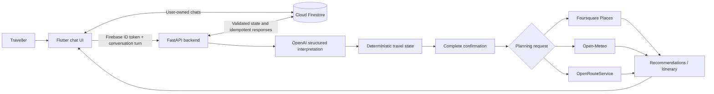

<div align="center">
  
  <h1>Trip Logic</h1>
  <p><strong>Conversational, constraint-aware travel planning for Sri Lanka.</strong></p>
</div>

## Overview

Trip Logic is an Android-focused Flutter application backed by FastAPI. Travellers describe what they need in natural language—from a simple restaurant search to a multi-stop day plan—and the system turns that conversation into validated, structured travel state.

OpenAI interprets language, while deterministic backend code controls validation, location verification, confirmation, provider requests, recommendation selection, and itinerary construction. Real places come from Foursquare, Sri Lankan localities and forecasts come from Open-Meteo, and route matrices come from OpenRouteService. Firebase Authentication secures the app, and Cloud Firestore stores each user's conversations and state.

## Key Features

- **Natural-language trip planning** with structured extraction of locations, dates, times, traveller details, transport modes, preferences, and corrections.
- **Explicit confirmation workflow** that presents a complete, readable summary before recommendations or itinerary generation.
- **Multi-request conversations** for attractions, restaurants, and hotels, including independent counts and localities for each request group.
- **Real place discovery** through category-controlled Foursquare searches, with deduplication, bounded retries, locality checks, and geographic safety validation.
- **Restaurant intent handling** that keeps cuisine preferences, dietary requirements, food avoidances, and meal intent separate without presenting search relevance as dietary certification.
- **Flexible attraction discovery** for broad requests such as “surprise me” and specific interests such as museums, heritage, nature, waterfalls, beaches, wildlife, and hiking.
- **Simple hotel discovery** without unrelated itinerary requirements, while complete itinerary requests can retain dates, traveller information, and accommodation preferences.
- **Context-aware enrichment** with weather suitability when a usable visit date/time exists and OpenRouteService route information when a genuine route origin and travel mode exist.
- **Recommendation cards** for provider-backed names, categories, addresses, distances, optional ratings and hours, route data, weather information, and concise explanations.
- **Conversation persistence** with user-owned Firestore histories, pinned chats, chat renaming, search, and deletion.
- **Account and profile tools** using Firebase email/password authentication, password reset, profile details, and persisted light/dark/system theme selection.

## How Trip Logic Works



The language model never calls travel providers directly. It returns a restricted interpretation; the backend applies that patch, verifies locations, calculates missing requirements, and chooses the next deterministic action. A clean confirmation dispatches the appropriate recommendation or itinerary pipeline immediately.

## Architecture

### Flutter application

The Flutter client provides the authentication, profile, conversation, history, and recommendation-card interfaces. It:

- initializes the configured Android Firebase application;
- obtains Firebase ID tokens for authenticated backend requests;
- writes pending traveller messages and listens to user-owned Firestore chats;
- sends revision-aware, idempotent conversation turns to FastAPI;
- parses validated travel context and recommendation payloads; and
- renders loading, confirmation, warning, error, recommendation, and itinerary messages.

The backend URL is a Dart compile-time setting named `API_BASE_URL`. Its Android-emulator default is `http://10.0.2.2:8000`.

### FastAPI backend

The Python backend exposes authenticated location, weather, place-search, route-matrix, recommendation, and conversation endpoints. Its conversation pipeline combines:

- OpenAI structured interpretation;
- Pydantic request and state validation;
- deterministic context patching and missing-field calculation;
- Sri Lanka-specific location verification and ambiguity handling;
- complete confirmation summaries and correction handling;
- recommendation task construction and provider orchestration;
- category, route, weather, traveller-fit, and search-relevance scoring; and
- itinerary construction for sufficiently complete, confirmed requests.

Firestore transactions provide ownership checks, optimistic context revisions, message validation, and request-level idempotency.

### Firebase

Firebase Authentication supplies the client session and ID token verified by Firebase Admin in FastAPI. Cloud Firestore stores data beneath user-owned paths such as `users/{uid}/chats/{chatId}` with nested messages and processed requests. The checked-in Firestore rules restrict each user to their own documents.

The repository's FlutterFire configuration currently targets Android. Other Flutter platforms require their own Firebase configuration before they can run.

## Current Integrations

| Service | Purpose in Trip Logic |
| --- | --- |
| OpenAI | Converts natural-language turns into a restricted structured interpretation; it does not invent or retrieve live place facts. |
| Foursquare Places | Discovers real hotels, restaurants, and attractions and supplies supported place metadata. |
| Open-Meteo Geocoding | Resolves and verifies Sri Lankan localities without an API key. |
| Open-Meteo Forecast | Supplies hourly forecast data for supported visit dates without an API key. |
| OpenRouteService | Calculates duration and distance matrices for supported driving, walking, and cycling routes. |
| Firebase Authentication | Provides email/password registration, login, password reset, and authenticated sessions. |
| Cloud Firestore | Persists profiles, chat summaries, messages, structured travel context, and idempotent backend responses. |

## Technology Stack

| Area | Implemented technology |
| --- | --- |
| Mobile client | Flutter, Dart (SDK constraint `^3.12.2`), Material 3 |
| Client networking | `http` 1.6.0 |
| Device capabilities | `geolocator` 14.0.3, `shared_preferences` 2.5.5 |
| Backend | Python, FastAPI 0.139.2, Uvicorn 0.51.0 |
| Validation | Pydantic 2.13.4, pydantic-settings 2.14.2 |
| Async HTTP | HTTPX 0.28.1 |
| AI SDK | OpenAI Python SDK 2.48.0 |
| Authentication | `firebase_auth` 6.5.4, Firebase Admin 7.5.0 |
| Database | `cloud_firestore` 6.6.0, Google Cloud Firestore 2.28.0 |
| Testing | Python `unittest`, Flutter `flutter_test` |

Dependency versions are defined in [`pubspec.yaml`](pubspec.yaml) and [`backend/requirements.txt`](backend/requirements.txt).

## Project Structure

```text
trip_logic/
├── android/                       # Android host project and app resources
├── backend/
│   ├── app/                       # FastAPI, conversation, provider, and planning modules
│   ├── tests/                     # Backend contract and regression tests
│   └── requirements.txt           # Pinned Python dependencies
├── lib/
│   ├── assets/                    # Branding and startup assets
│   ├── models/                    # Conversation, context, and recommendation DTOs
│   ├── pages/                     # Authentication, chat, and profile screens
│   ├── services/                  # Backend, Firestore, and device-location clients
│   ├── theme/                     # Material light/dark themes
│   └── widgets/                   # Recommendation presentation
├── test/                          # Maintained Flutter model/widget regressions
├── firebase.json                  # Firebase project and deployment configuration
├── firestore.rules               # User-ownership security rules
├── pubspec.yaml                   # Flutter dependencies and assets
└── run_trip_logic.ps1             # Windows backend + physical Android launcher
```

## Getting Started

### Prerequisites

- Flutter with an SDK compatible with the Dart constraint in `pubspec.yaml`.
- Android SDK tooling and an Android emulator or USB-debuggable physical device.
- Python 3 with virtual-environment support.
- A Firebase project with Android, Email/Password Authentication, and Cloud Firestore configured.
- A Firebase Admin service-account JSON file stored outside version control.
- OpenAI, Foursquare Places, and OpenRouteService credentials.

Open-Meteo does not require an API key in this implementation.

### Backend setup

From PowerShell:

```powershell
Set-Location C:\path\to\trip_logic\backend

python -m venv .venv
.\.venv\Scripts\Activate.ps1
python -m pip install --upgrade pip
python -m pip install -r requirements.txt
```

Create `backend/.env` and configure the variables listed below. The file is excluded by [`backend/.gitignore`](backend/.gitignore).

Start FastAPI from the `backend` directory:

```powershell
.\.venv\Scripts\python.exe -m uvicorn app.main:app `
  --host 0.0.0.0 `
  --port 8000 `
  --log-level debug
```

When running, the health endpoint is available at `http://127.0.0.1:8000/health`, and FastAPI's interactive API documentation is available at `http://127.0.0.1:8000/docs`.

### Environment variables

| Variable | Required | Purpose |
| --- | --- | --- |
| `FIREBASE_CREDENTIALS_PATH` | Yes | Path to the private Firebase Admin service-account JSON file. |
| `FOURSQUARE_API_KEY` | Yes | Bearer credential for Foursquare Place Search. |
| `OPENROUTESERVICE_API_KEY` | Yes | Credential for OpenRouteService route matrices. |
| `OPENAI_API_KEY` | Yes | Credential used by the structured conversation interpreter. |
| `OPENAI_MODEL` | No | OpenAI model identifier; defaults to `gpt-5-mini`. |
| `APP_NAME` | No | FastAPI application title; defaults to `Trip Logic API`. |
| `ENVIRONMENT` | No | Runtime environment label; defaults to `development`. |

`API_BASE_URL` is not a backend environment variable. It is supplied to Flutter with `--dart-define` at build/run time.

### Firebase configuration

The repository contains Android FlutterFire output, [`firebase.json`](firebase.json), and [`firestore.rules`](firestore.rules). Before running against another Firebase project:

1. configure that project's Android application;
2. enable Email/Password Authentication and Cloud Firestore;
3. ensure the Android client configuration matches the selected project; and
4. point `FIREBASE_CREDENTIALS_PATH` at a private Firebase Admin service-account file.

Do not place the Admin service-account JSON in source control. The backend ignore rules cover the expected `*-firebase-adminsdk-*.json` naming pattern.

### Running the Flutter app

Install Flutter packages once:

```powershell
Set-Location C:\path\to\trip_logic
flutter pub get
flutter devices
```

For a connected physical Android device, the repository launcher verifies `backend\.venv`, starts FastAPI on port `8000` when necessary, establishes ADB reverse port forwarding, and runs Flutter with the correct loopback URL:

```powershell
.\run_trip_logic.ps1
```

The equivalent manual device commands are:

```powershell
& "$env:LOCALAPPDATA\Android\Sdk\platform-tools\adb.exe" reverse tcp:8000 tcp:8000
flutter run --dart-define=API_BASE_URL=http://127.0.0.1:8000
```

For an Android emulator, `flutter run` uses the checked-in default backend address `http://10.0.2.2:8000`.

## Testing

The backend suite contains provider contracts, conversation regressions, generated invariant cases, state-machine sequences, retry/failure simulations, locality checks, and recommendation-budget tests. All provider calls are mocked in automated tests.

Run the backend suite from `backend`:

```powershell
Set-Location backend
.\.venv\Scripts\python.exe -m unittest discover -s tests -p "test_*.py"
```

Run the maintained Flutter model and recommendation presentation tests from the repository root:

```powershell
flutter test `
  test/conversation_message_presentation_test.dart `
  test/recommendation_group_model_test.dart `
  test/recommendation_group_view_test.dart `
  test/room_count_removal_test.dart
```

Run static analysis with:

```powershell
flutter analyze
```

Live provider tests should remain small and deliberate; credentials must never be printed or embedded in fixtures.

## Foursquare Design Notes

- The backend owns all category IDs and uses Foursquare Place Search for hotel, restaurant, and attraction discovery.
- Verified search locality and route origin are separate concepts. Named localities use their canonical Sri Lankan name for discovery, while trusted coordinates remain the geographic safety reference.
- Generic attraction requests use broad, category-only discovery; specific interests retain useful semantic intent.
- Restaurant cuisine, dietary requirements, avoidances, and meal intent remain separate. Provider search relevance is not treated as dietary certification.
- Search results are normalized, coordinate-checked, locality-checked where evidence is strong, deduplicated by stable provider identity, and bounded before downstream route enrichment.
- Rating and structured opening hours are optional. They remain unavailable when the provider does not return them; the application never substitutes zero, guessed hours, or hotel stars.
- The implementation reuses one Foursquare client per recommendation task, supports bounded grouped concurrency, and does not add per-place Details requests.

## Security and Configuration

- Never commit `backend/.env`, Firebase Admin service-account files, API keys, bearer tokens, or copied request headers.
- Keep OpenAI, Foursquare, and OpenRouteService credentials on the backend; Flutter receives only the backend base URL.
- FastAPI verifies Firebase bearer tokens and rechecks Firestore ownership for conversation operations.
- Firestore rules restrict profile and chat access to the authenticated user ID.
- Conversation revisions and request IDs protect against stale updates and duplicate processing.
- Treat provider responses as untrusted input: missing or malformed optional data remains unavailable rather than being invented.

## Development Status

Trip Logic is an actively developed software-engineering project. Its Foursquare-backed conversation and recommendation paths have focused contract, regression, generated-state, and widget coverage, but this README does not characterize the application as production-ready.

Current scope notes:

- Android is the only FlutterFire platform configured in this repository.
- Ratings and opening hours depend on Foursquare returning the approved optional metadata.
- Weather enrichment requires a supported visit date and usable timing; otherwise it remains unavailable.
- Device-location models and a permission-aware location service exist, but the current chat send flow does not yet attach device coordinates.
- The client and models define message-edit operations, but the backend edit endpoint is not connected yet. Corrections made as new conversation turns are supported.

## Screenshots

> Screenshots will be added here as the interface evolves.

The repository currently contains app branding and Android launch assets, but no genuine in-app screenshots.

## Contributing

Keep changes narrowly scoped and preserve the separation between language interpretation and deterministic backend validation. Before opening a change:

1. add or update focused regression tests;
2. run the affected backend and Flutter suites;
3. run `flutter analyze`; and
4. ensure secrets, generated credentials, and provider IDs intended to remain private are not exposed.

## License

License information has not yet been added to this repository.
