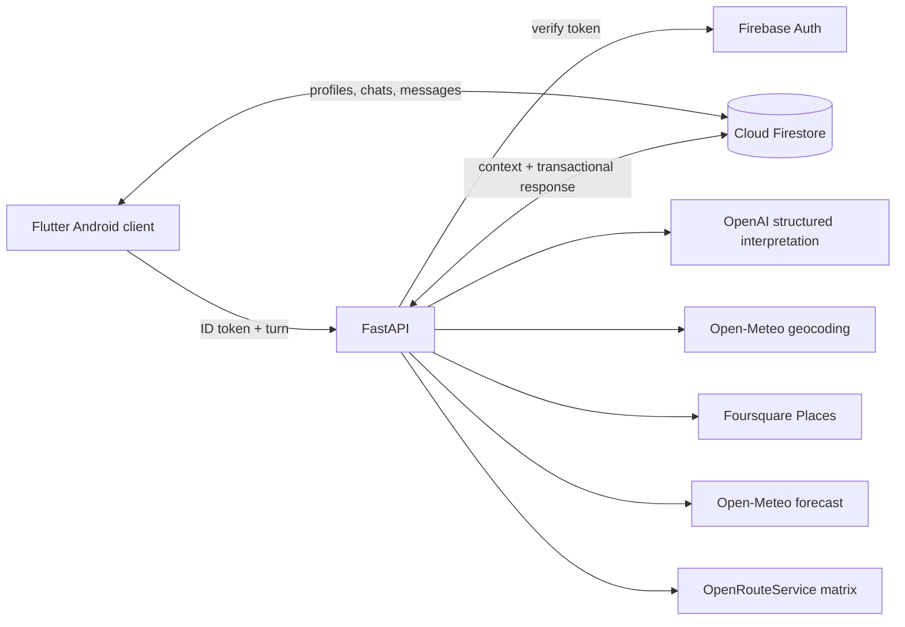

<div align="center">
  

  <h1>Trip Logic</h1>

  <p><strong>Conversational, constraint-aware travel discovery and day planning for Sri Lanka.</strong></p>


</div>

<div align="center">

[Overview](#overview) | [Implemented Features](#implemented-features) | [Architecture and Flow](#architecture-and-flow) | [Technology Stack](#technology-stack) | [Project Structure](#project-structure)

</div>

---

## Overview

Trip Logic is an Android Flutter application and FastAPI service for conversational travel discovery in Sri Lanka. A traveller can describe one or more hotel, restaurant, or attraction searches, refine the details over multiple messages, confirm the resulting travel context, and receive ranked live place results. Complete requests can also produce a timed, route-aware single-day itinerary.

OpenAI converts natural language into a validated interpretation schema. It does not invent places or directly mutate trusted state: deterministic backend code applies patches, decides which details are missing, verifies localities, controls confirmation, calls travel providers, ranks candidates, builds itineraries, and commits the result to Firestore.

## Implemented Features

- Multi-turn extraction and correction of dates, times, locations, party details, transport modes, result counts, accessibility needs, and preferences.
- Independent request groups for attractions, hotels, and restaurants, including separate search localities and requested counts.
- Restaurant-specific cuisine, dietary, avoidance, and meal-intent handling; attraction intent-to-category presets.
- Sri Lankan locality verification and ambiguity prompts using Open-Meteo geocoding.
- Foursquare place discovery with trusted category filters, radius/locality checks, deduplication, retry handling, and optional rating/hours fallback.
- Explainable ranking using category match, provider position, route cost, forecast suitability, and traveller-type fit.
- Route distance/duration enrichment through OpenRouteService and forecast enrichment through Open-Meteo when the required context exists.
- Timed single-day attraction/restaurant itineraries with feasible stop selection, travel legs, visit durations, spare time, and return to the route origin.
- Firebase email/password registration, login, reset, profile storage, user-owned chat history, chat search/rename/pin/delete, and light/dark/system themes.

## Architecture and Flow


```mermaid
flowchart LR
    C[Flutter Android client] -->|ID token + turn| API[FastAPI]
    C <-->|profiles, chats, messages| DB[(Cloud Firestore)]
    API -->|verify token| AUTH[Firebase Auth]
    API <-->|context + transactional response| DB
    API --> OAI[OpenAI structured interpretation]
    API --> GEO[Open-Meteo geocoding]
    API --> FSQ[Foursquare Places]
    API --> WX[Open-Meteo forecast]
    API --> ORS[OpenRouteService matrix]
```

1. The client transactionally creates a pending traveller message and sends its IDs, text, and expected context revision to `POST /conversation/turn`.
2. FastAPI verifies the Firebase token, chat ownership, message contents, revision, and request-id idempotency.
3. Simple confirmations use a deterministic fast path; other turns use OpenAI structured output with the trusted context and up to six recent messages.
4. Backend rules apply the patch, preserve location roles, verify Sri Lankan places, calculate missing fields, and ask the next canonical question or show a confirmation summary.
5. After confirmation, one validated recommendation task per request group runs concurrently. Foursquare candidates are normalized, bounded, enriched, scored, and split into the top three plus additional results.
6. When requested, the itinerary builder selects up to five stops from at most eight attraction/restaurant candidates and schedules them inside the available window.
7. A Firestore transaction advances the context revision, marks the pending message delivered, stores the assistant response, updates the chat, and records the response for safe retries.

### Recommendation Rules

| Rule                 | Current implementation                                  |
| :------------------- | :------------------------------------------------------ |
| Default/result limit | 6 by default; explicit counts from 1 to 19              |
| Search radius        | Attractions 25 km, hotels 20 km, restaurants 12 km      |
| Ordering             | Score descending, then route duration, then name        |
| Score inputs         | Category, route, weather, traveller type, provider rank |
| Forecast horizon     | Today through the next 13 days                          |
| Itinerary            | One day, up to 5 stops, minimum 30 minutes per stop     |

Missing route, forecast, rating, or hours data remains unavailable rather than being fabricated. Hotel results are discovery only: there are no prices, rooms, availability, or booking operations. Dietary preferences influence search text but are not provider-certified guarantees.

### API Surface

All listed endpoints except `/health` require `Authorization: Bearer <firebase-id-token>`. Interactive OpenAPI documentation is available at `/docs` while the API is running.

| Method | Endpoint                    | Purpose                               |
| :----- | :-------------------------- | :------------------------------------ |
| `GET`  | `/health`                   | Service/environment status            |
| `GET`  | `/auth/me`                  | Selected verified token claims        |
| `GET`  | `/locations/search`         | Sri Lankan locality search            |
| `GET`  | `/weather/forecast`         | Normalized hourly forecast            |
| `GET`  | `/places/search`            | Bounded Foursquare search             |
| `POST` | `/routes/matrix`            | Matrix for 2–20 coordinates           |
| `POST` | `/recommendations/generate` | Direct typed recommendation request   |
| `POST` | `/conversation/turn`        | Validate, process, and persist a turn |

## Technology Stack

| Area                    | Implementation                                                            |
| :---------------------- | :------------------------------------------------------------------------ |
| Mobile                  | Flutter, Material 3, Dart SDK constraint `^3.12.2`                        |
| Android                 | Gradle 9.1.0, Android Gradle Plugin 9.0.1, Kotlin 2.3.20, JVM 17          |
| Backend                 | Python, FastAPI 0.139.2, Uvicorn 0.51.0, Pydantic 2.13.4, HTTPX 0.28.1    |
| Language interpretation | OpenAI Python SDK 2.48.0, Responses API structured parsing                |
| Identity/storage        | Firebase Authentication, Firebase Admin, Cloud Firestore                  |
| Travel data             | Foursquare Places, Open-Meteo Geocoding/Forecast, OpenRouteService Matrix |
| Client state            | Firebase Auth/Firestore plus `shared_preferences` for theme mode          |

Dependency declarations are in [`pubspec.yaml`](pubspec.yaml), [`pubspec.lock`](pubspec.lock), and [`backend/requirements.txt`](backend/requirements.txt).

## Project Structure

```text
trip_logic/
├── android/                    # Android host, manifests, Gradle, app resources
├── backend/
│   ├── app/                    # API, conversation, providers, ranking, itinerary
│   ├── tests/                  # Backend contracts, regressions, and invariants
│   └── requirements.txt        # Pinned Python packages
├── lib/
│   ├── models/                 # Typed conversation and recommendation models
│   ├── pages/                  # Onboarding, auth, chat, and profile screens
│   ├── services/               # API, Firestore, and device-location clients
│   ├── theme/                  # Material themes and saved preference
│   └── widgets/                # Recommendation result presentation
├── test/widget_test.dart       # Unreplaced Flutter template test
├── firebase.json               # FlutterFire/Firestore configuration
├── firestore.rules             # Per-user profile and chat access
├── pubspec.yaml                # Flutter package and asset configuration
└── run_trip_logic.ps1          # Windows API/emulator convenience launcher
```

## Setup and Configuration

### Prerequisites

- Flutter/Dart compatible with the declared SDK constraint, Android SDK tooling, and Java 17.
- Python 3.10 or newer with virtual-environment support.
- A Firebase project with an Android app, Email/Password Authentication, and Cloud Firestore.
- A Firebase Admin service-account JSON file stored outside version control.
- OpenAI, Foursquare Places, and OpenRouteService API credentials. Open-Meteo needs no key here.

### Backend

From the repository root in PowerShell:

```powershell
Set-Location backend
python -m venv .venv
.\.venv\Scripts\Activate.ps1
python -m pip install -r requirements.txt
```

Create `backend/.env` with these names. All four credential settings are validated during application import; do not commit real values.

```dotenv
FIREBASE_CREDENTIALS_PATH=C:/secure/path/firebase-admin-service-account.json
FOURSQUARE_API_KEY=replace_with_foursquare_key
OPENROUTESERVICE_API_KEY=replace_with_openrouteservice_key
OPENAI_API_KEY=replace_with_openai_key

# Optional
OPENAI_MODEL=gpt-5-mini
APP_NAME=Trip Logic API
ENVIRONMENT=development
```

Start the API from `backend/`:

```powershell
.\.venv\Scripts\python.exe -m uvicorn app.main:app `
  --host 0.0.0.0 --port 8000 --log-level debug
```

Check `http://127.0.0.1:8000/health` or `http://127.0.0.1:8000/docs`.

### Flutter Client

The tracked FlutterFire files configure the existing Android Firebase app. For another Firebase project, regenerate both `android/app/google-services.json` and `lib/firebase_options.dart`, and use a backend service account from the same project.

From the repository root:

```powershell
flutter pub get
flutter run
```

The client defaults `API_BASE_URL` to `http://10.0.2.2:8000`, the host loopback address used by the standard Android emulator. Override it at build/run time when needed:

```powershell
flutter run --dart-define=API_BASE_URL=https://api.example.com
flutter build apk --debug --dart-define=API_BASE_URL=https://api.example.com
```

For local Windows development, `.\run_trip_logic.ps1` expects `backend/.venv`, ADB in the standard Android SDK location, and the device ID `emulator-5554`. It starts FastAPI if port 8000 is closed, applies `adb reverse`, and runs Flutter against `http://127.0.0.1:8000`.

## Testing

```powershell
# From backend/
.\.venv\Scripts\python.exe -m unittest discover -s tests -p "test_*.py"

# From the repository root
flutter analyze --no-pub
flutter test --no-pub
```

Current repository verification: all **271 backend tests pass**, and Flutter analysis reports no issues. `flutter test` currently fails because `test/widget_test.dart` is the generated counter test and pumps `MyApp` without Firebase initialization. Provider boundaries in the backend suite use mocks or HTTPX mock transports; no CI or coverage workflow is configured.

## Security and Data Handling

- The client attaches Firebase ID tokens; FastAPI checks expiry, revocation, disabled users, and UID presence.
- Firestore rules scope profiles and nested chats to the authenticated UID. Backend transactions recheck ownership and context revision.
- Non-fast-path turns send the latest message, trusted context, up to six prior message strings, and an optional first name to OpenAI with `store=False`.
- Foursquare receives search terms/categories and coordinates; OpenRouteService receives coordinates and travel mode; Open-Meteo receives locality queries or coordinates and dates.
- Keep `backend/.env`, Firebase Admin JSON, API keys, and authorization headers untracked. Debug Android builds permit cleartext traffic for local HTTP; deployments should use HTTPS.

## Current Limitations

- Only Android is configured; there are no iOS, web, desktop, container, hosting, or CI definitions, and the release build still uses debug signing.
- Device-location models and permission services exist, but the chat send path does not attach coordinates.
- The edit operation exists in the models but returns HTTP `501`; corrections must be sent as new messages.
- Google and Facebook controls are visual only and have no sign-in handlers.
- Registration sends a verification email when possible, but access is not gated on `emailVerified`.
- Full itineraries require a final ending location, but scheduling uses only `tripStartDate` and returns to the start/daily base without using that ending location.
- Forecast-backed recommendations are limited to 14 days; optional provider metadata and enrichment can be unavailable.
- The application discovers and ranks places but does not provide booking, pricing, tickets, or inventory.

---

## Contact Information

**Developer**: Dillon Fernandez<br>
**Email**: dillonfernandez@gmail.com<br>
**Institution**: APIIT

---

<div align="center">
  <p><strong>Disclaimer</strong></p>
  <p><em>This is an academic project developed for educational purposes and is not intended for commercial use.</em></p>
</div>
